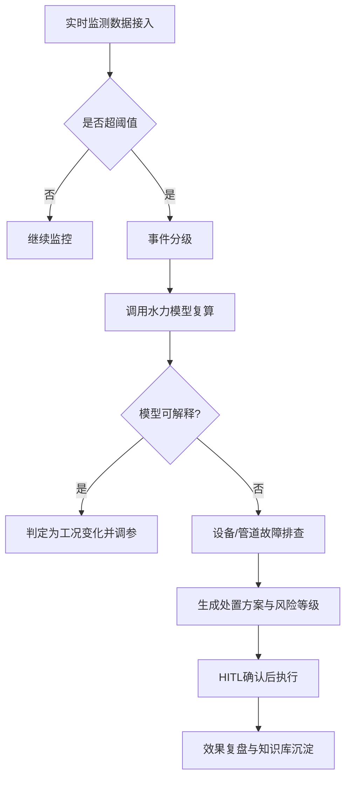

# 管道系统故障诊断知识

## 1. 常见故障类型

### 1.1 水力故障

#### 1.1.1 压力异常

| 故障现象 | 可能原因 | 诊断方法 | 处理措施 |
|---------|---------|---------|---------|
| 出站压力偏高 | 下游阻力增大 | 检查沿线阀门开度 | 调整阀门，清管 |
| 出站压力偏低 | 泵效率下降 | 检测泵性能曲线 | 检修或更换泵 |
| 进站压力过低 | 上游供液不足 | 检查上游站运行 | 调整上游输量 |
| 压力波动大 | 气蚀或气阻 | 检查吸入压力 | 提高吸入压头 |

#### 1.1.2 流量异常

| 故障现象 | 可能原因 | 诊断方法 | 处理措施 |
|---------|---------|---------|---------|
| 流量不足 | 泵磨损、阀门未全开 | 核对泵出口压力 | 检修泵，调整阀门 |
| 流量过大 | 下游压力过低 | 检查下游运行工况 | 调整运行参数 |
| 流量不稳 | 介质含气、泵故障 | 检查进口气体 | 排气，检修泵 |

### 1.2 设备故障

#### 1.2.1 泵故障

| 故障类型 | 症状表现 | 诊断指标 | 处理方法 |
|---------|---------|---------|---------|
| 轴承磨损 | 振动增大、温升高 | 振动值>4.5mm/s | 更换轴承 |
| 机械密封失效 | 泄漏、异响 | 泄漏量增大 | 更换密封 |
| 叶轮磨损 | 扬程下降、效率降低 | 效率下降>5% | 更换叶轮 |
| 汽蚀 | 噪音、振动、流量下降 | NPSHa < NPSHr | 提高吸入压头 |

#### 1.2.2 电机故障

| 故障类型 | 症状表现 | 诊断指标 | 处理方法 |
|---------|---------|---------|---------|
| 过载 | 电流过大、温升高 | 电流>额定值1.1倍 | 降低负荷 |
| 绝缘老化 | 接地故障 | 绝缘电阻<0.5MΩ | 检修绕组 |
| 轴承故障 | 异响、振动 | 温度>80°C | 更换轴承 |

## 2. 故障诊断方法

### 2.1 基于运行参数的诊断

```
诊断流程:
1. 采集实时运行数据
2. 与历史数据对比
3. 计算偏差率
4. 判断是否超限
5. 定位故障原因
```

### 2.2 关键诊断指标

#### 压力相关指标

- **压力偏差率**: (实际值 - 设计值) / 设计值 × 100%
  - 正常范围: ±5%
  - 警告范围: ±5% ~ ±10%
  - 报警范围: >±10%

#### 效率相关指标

- **泵效率**: η = (ρgQH) / (1000P) × 100%
  - 正常范围: ≥75%
  - 警告范围: 70% ~ 75%
  - 报警范围: <70%

#### 能耗相关指标

- **单位输油能耗**: E = P / (Q × L)
  - 正常范围: ≤设计值的1.1倍
  - 警告范围: 1.1 ~ 1.2倍
  - 报警范围: >1.2倍

### 2.3 故障预警逻辑

```python
# 故障预警判断逻辑示例
def diagnose_pump_fault(current, rated_current, vibration, temperature):
    warnings = []

    # 电流检测
    current_ratio = current / rated_current
    if current_ratio > 1.1:
        warnings.append("电流过载警告")
    elif current_ratio > 1.2:
        warnings.append("电流严重过载报警")

    # 振动检测
    if vibration > 4.5:
        warnings.append("振动超标警告")
    elif vibration > 7.0:
        warnings.append("振动严重超标报警")

    # 温度检测
    if temperature > 70:
        warnings.append("温度偏高警告")
    elif temperature > 85:
        warnings.append("温度过高报警")

    return warnings
```

## 3. 典型故障案例

### 3.1 案例一：泵站出站压力异常

**故障描述**: 某泵站出站压力较正常值升高0.5MPa

**诊断过程**:
1. 检查沿线阀门状态 → 全部正常
2. 检查下游进站压力 → 也升高
3. 分析输送介质变化 → 油品密度增大
4. 重新计算水力工况 → 确认参数变化

**处理措施**: 调整泵运行组合，减少开泵台数

**经验总结**: 油品性质变化会显著影响水力工况，应建立油品变化预警机制

### 3.2 案例二：泵效率下降

**故障描述**: 泵运行效率从82%下降到75%

**诊断过程**:
1. 检测泵振动 → 正常
2. 检测轴承温度 → 正常
3. 绘制实际性能曲线 → 扬程-流量曲线下移
4. 拆检叶轮 → 发现磨损

**处理措施**: 更换叶轮，效率恢复到81%

**经验总结**: 定期进行泵性能测试，及时发现效率下降趋势

### 3.3 案例三：管道压降异常增大

**故障描述**: 沿程摩阻较计算值增大30%

**诊断过程**:
1. 检查流量 → 正常
2. 检查油品粘度 → 略有增大但不足以解释
3. 检查管道内壁 → 发现结蜡

**处理措施**: 进行清管作业，压降恢复正常

**经验总结**: 应根据季节和油品特性制定合理的清管周期

## 4. 预防性维护建议

### 4.1 定期检测项目

| 检测项目 | 周期 | 检测内容 | 判定标准 |
|---------|-----|---------|---------|
| 泵性能测试 | 每季度 | 扬程、流量、效率 | 效率下降<5% |
| 振动监测 | 每月 | 振动幅值、频谱 | <4.5mm/s |
| 油液分析 | 每月 | 水分、杂质 | 水分<0.5% |
| 电气检测 | 每半年 | 绝缘、接地 | 绝缘>0.5MΩ |

### 4.2 状态监测系统

建议配置以下在线监测系统:
- 压力监测系统
- 流量监测系统
- 振动监测系统
- 温度监测系统
- 泄漏检测系统

### 4.3 智能诊断系统

利用机器学习技术建立故障预测模型:
- 基于历史数据训练
- 实时数据输入分析
- 自动生成预警信息
- 提供维护建议

## 5. 故障类型覆盖清单（管道 + 泵站）

### 5.1 管道侧

1. **泄漏**：表现为流量平衡破坏、压力异常下跌、局部温度变化；
2. **堵塞**：沿程压降升高、同流量下泵负荷升高；
3. **腐蚀减薄**：长期风险，短期可通过超声/内检测发现壁厚异常；
4. **冲刷磨损**：弯头、三通、阀后段风险高，表现为局部振动和噪声上升。

### 5.2 泵站侧

1. **气蚀**：高频噪声、振动上升、扬程突降；
2. **密封泄漏**：密封腔压力偏离、外泄量增加；
3. **振动异常**：可能来自轴承、对中、转子不平衡或基础松动；
4. **电机过载**：电流持续高于额定区间，伴随温升。

## 6. 基于水力参数的异常检测规则

建议构建“模型预测值 vs 实测值”偏差监测：

$$
\Delta P = P_{measured} - P_{model}, \quad \Delta Q = Q_{measured} - Q_{plan}
$$

推荐分级阈值（可按项目校准）：

- 一级预警：`|ΔP| > 0.15 MPa` 或 `|ΔQ|/Q_plan > 5%`
- 二级告警：`|ΔP| > 0.30 MPa` 或 `|ΔQ|/Q_plan > 10%`
- 三级报警：`|ΔP| > 0.50 MPa` 或持续 10 分钟以上偏差失控

当触发二级以上告警时，应自动拉取最近一次计算参数（密度、粘度、粗糙度、泵效率）并执行回归计算，识别是“介质变化”还是“设备故障”。

## 7. 故障诊断流程图（文本版）



## 8. 实施建议：诊断闭环

1. **检测层**：分钟级采集压力、流量、温度、电流、振动；
2. **分析层**：规则引擎 + 水力复算 + 趋势模型联合判定；
3. **处置层**：自动建议 + 人工确认（HITL） + 操作留痕；
4. **学习层**：把处置结果写回案例库，持续更新阈值和规则。

通过以上闭环，故障诊断能力可从“事后判断”提升到“事前预警 + 在线纠偏”。
